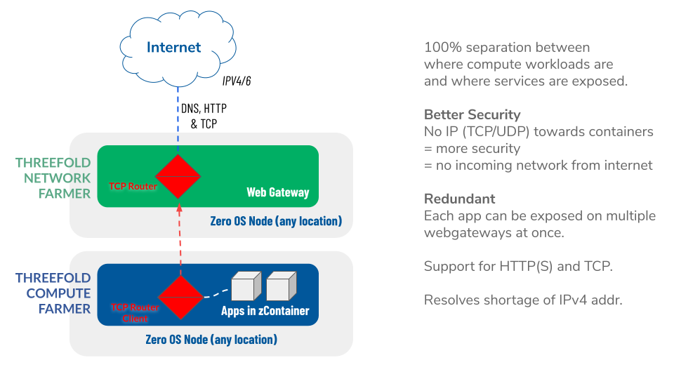
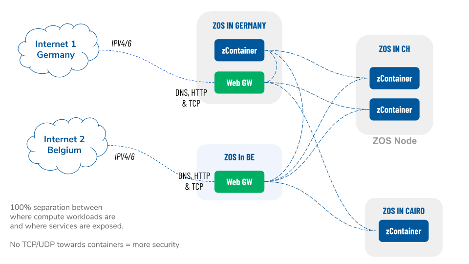
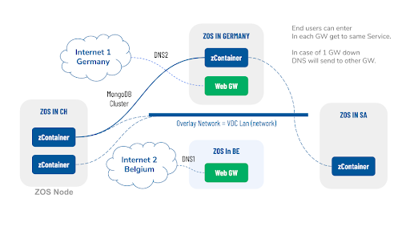

# Hercules Network

## What is Hercules Network?

Decentralized networking platform allowing any compute and storage workload  to be connected together on a private (overlay) network and exposed to the existing internet network. The Peer2Peer network platform allows any workload  to be connected over secure encrypted networks which will look for the shortest path between the nodes.

## Features of the Hercules Network.

### Secure mesh overlay network (peer2peer)

Hercules Network is the foundation of any architecture running on the TF Grid.  It can be seen as a virtual private datacenter and the network allows all of the *N* containers to connected to all of the *(N-1)* other containers. Any network connection is a secure network connection between your containers and creates a 100% peer 2 peer network between containers. 

No connection is made with the internet. The Virtual Private Datacenter is a single tenant network and by default not connected to the public internet.  Everything stays 100% private. For connecting to the public internet a Web Gateway is included in the product to allows for public access if and when required.

### Web Gateway

The Web Gateway is a mechanism to connect the private (overlay) networks to the open Internet.  If (parts of) this private overlay network need to be reachable from the Internet, the containers imitate a secure connection *to* the web Gateway. It is very important to mention that this connection is not a standard network connection, it is a [network socket](https://en.wikipedia.org/wiki/Network_socket) initiated by the container to the web gateway. The container calls out to one or more web gateways and sets up a secure & private socket connection to the web gateway. The type of connection required is defined on the smart contract for IT layer and as such is very secure. There is no IP (TCP/UDP) coming from the internet towards the containers providing more security. 

Up to the Web Gateway Internet traffic follows the same route as for any other network end point: A DNS entry tells the consumers client to what IP address to send traffic to.  This endpoint is the public interface of the Web Gateway.  That interface accepts the 
HTTP(s) (or any other TCP) packets and forward the packet payload  over the secure socket connection (initiated by the container) to the container.  

No open pipe (NAT plus port forwarding) from the public internet to specific containers in the private (overlay) network exists.

Web Gateways are created by so called network farmers.  Network farmers are people and companies that have access to good connectivity and have a large number of public IP routable IP networks.  They provide the facilities (hardware) for Web Gateways to run and terminate a lot of the public inbound and output traffic for the TF Grid.  Examples of network farmers are ISP's and (regional, national and international Telcos, internet exchanges etc.

### Security

Buy not providing an open and direct path in to the private network a lot of malicious phishing and hacking attempts are stopped at the Web Gateway.  By design any private network is meant to have multiple webgateways and by design these Web Gateways exist on different infrastructure in a different location.  Sniffing around and finding  out what can be done with a Web Gateway might (and will happen) but it will not compromise the containers in your private network.

### Ultra Redundancy

- Any app can get (securely) connected to the internet by any chosen IP address made available by ThreeFold network farmers.
- An app can be connected to multiple gateways at once, the DNS round robin principle will provide load balancing and redundancy.
- An easy clustering mechanism where web gateways and nodes can be lost and the public service will still be up and running.
- Easy maintenance. When containers are moved or re-created the same end user connection can be reused as that connection is terminated on the Web Gateway. The moved or newly created Web Gateway will recreate the socket to the Web Gateway and receive inbound datagrams.

### Enterprise Connectivity (OEM)

For enterprise use cases we allow zero-os’es to be connected to any locally deployed networks.  The network module on Zero-OS facilitates for all over the described features and functionality in the section above but we do understand that there is a lot of existing secure networking architectures and standards in use.  We embrace those existing standards in OEM use cases and can enhance the networking module to embrace and use these existing secure networking structures.

Supported technologies:

*   VXLan
*   IPSec
*   VLAN
*   Direct Network bridges
*   … any other chosen network technology can easily be integrated

## Architecture

### 100% redundancy

### Unlimited Scalability

The network architecture is a pure scale-out network system, it can scale to unlimited size, there is simply no bottleneck. Network "supply" is created by network farmers, and network "demand" is done by TF Grid users.  Supply and demand scale independently, for supply there can be unlimited network farmers providing the web gateways on their own 3nodes and unlimited compute farmers providing 3nodes for compute and storage. The demand side is driven by developers creating software that runs on the grid, system integrators creating solutions for enterprise and this demand side is exponentially growing for data processing and storage use cases.

## Main Benefits

!!!include:hercules_usp_sustainable
!!!include:hercules_usp_manageable
!!!include:hercules_usp_scalable
!!!include:hercules_usp_reliable_secure

## Roadmap

### v2.2: Active (all features as described above are available)

- Done

### OEM ideas (custom development for larger projects):

*   For enterprise use cases we can support NetFlow functionality creating monitoring capabilities for all network traffic. 
*   Custom admin interfaces can be created for enterprise use-cases.
